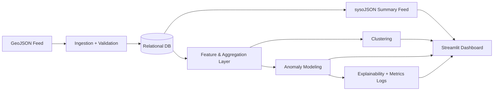
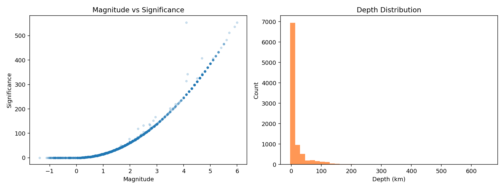
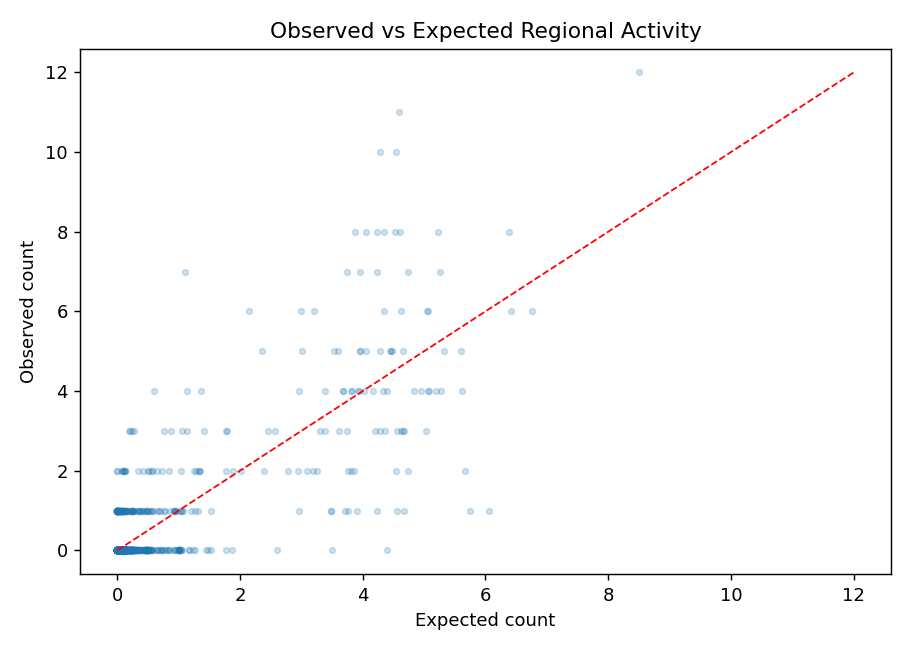
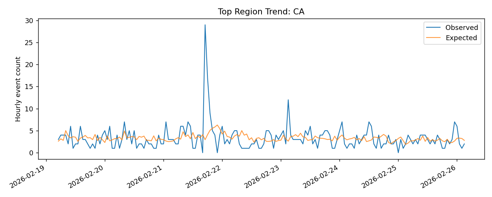

# Real-Time Earthquake Analytics

Production-style earthquake analytics system with minute-level refresh, validation-first ingestion, relational storage, anomaly modeling, explainability outputs, and a live Streamlit dashboard.

## Live App

- Streamlit dashboard: [https://real-time-earthquake-analytics-57bvnvydgnv5gz8bgnurfu.streamlit.app/](https://real-time-earthquake-analytics-57bvnvydgnv5gz8bgnurfu.streamlit.app/)

## Overview

This project builds an end-to-end analytics pipeline for earthquake monitoring from `all_month.geojson`:

- Ingests new events every run (supports HTTP and local file source).
- Runs strict validation and quality checks before storage.
- Stores curated records in a relational database via SQLAlchemy.
- Generates `sysoJSON` summary outputs for downstream use.
- Detects spatial-temporal clusters (aftershock/surge behavior).
- Scores unusual regional activity with a lightweight model.
- Logs model metrics and explainability artifacts for each run.
- Serves interactive map + trend + alert panels in Streamlit.

## Architecture



## Repository Structure

```text
.
|-- dashboard/
|   `-- app.py
|-- data/
|   `-- all_month.geojson
|-- docs/
|   |-- hypothesis_matrix.md
|   `-- runbook.md
|-- artifacts/
|   |-- eda_hypothesis_plots.png
|   |-- model_validation_scatter.png
|   |-- model_validation_timeseries.png
|   |-- model_metrics_latest.json
|   |-- model_metrics_history.jsonl
|   |-- model_explainability_latest.json
|   `-- model_run.log
|-- output/
|   |-- syso_summary_feed.json
|   `-- syso_summary_feed.geojson
`-- src/earthquake_analytics/
```

## Quick Start

### 1. Install

```bash
pip install -e .
```

### 2. Configure

```bash
copy .env.example .env
```

Key variables:

- `EARTHQUAKE_SOURCE_URL` (default local: `data/all_month.geojson`)
- `EARTHQUAKE_DB_URL` (default SQLite)
- `REFRESH_INTERVAL_SECONDS`
- `MAG_ALERT_THRESHOLD`
- `ANOMALY_Z_THRESHOLD`

### 3. Run One Pipeline Cycle

```bash
python -m earthquake_analytics
```

### 4. Run Every Minute (Scheduler)

```bash
python -m earthquake_analytics.run_scheduler
```

### 5. Launch Dashboard

```bash
python -m streamlit run dashboard/app.py
```

## Visualizations

### Hypothesis-Driven EDA



### Model Validation: Predicted vs Observed



### Model Validation: Time-Series Comparison



## Outputs

| Category | File |
|---|---|
| Summary Feed (JSON) | `output/syso_summary_feed.json` |
| Summary Feed (GeoJSON) | `output/syso_summary_feed.geojson` |
| Latest Metrics | `artifacts/model_metrics_latest.json` |
| Metrics History | `artifacts/model_metrics_history.jsonl` |
| Explainability | `artifacts/model_explainability_latest.json` |
| Run Logs | `artifacts/model_run.log` |

## Modeling and Explainability

- The model estimates expected regional event counts from recent and seasonal patterns.
- Anomaly scores are computed using z-scores on observed vs expected activity.
- Explainability is provided through component-level contribution breakdowns and reason flags for anomalous regions.
- Classification and regression metrics are logged each run (`precision`, `accuracy`, `recall`, `f1`, `mae`, `rmse`).

## Quality Controls

Hard rejection checks:

- Missing event IDs or required fields
- Invalid timestamps/geometry/coordinates
- Coordinate range violations

Soft warning checks:

- Missing magnitude
- High RMS / azimuthal gap
- Non-earthquake event types
- Out-of-window age

## Deployment

Dashboard can be deployed quickly on Streamlit Community Cloud (`dashboard/app.py` as entrypoint).  
For full production behavior (scheduler + DB + dashboard), deploy pipeline/scheduler on a worker service and dashboard as a separate web service.

## GitHub Actions Scheduler (Free Worker Alternative)

This repository includes `.github/workflows/earthquake_pipeline.yml` which runs the full pipeline on a cron schedule and manual trigger.

Setup:

1. In GitHub repo settings, add secret `EARTHQUAKE_DB_URL` with your Neon/Postgres SQLAlchemy URL:
   - `postgresql+psycopg2://<user>:<password>@<host>/<db>?sslmode=require`
2. Keep Streamlit app configured with the same database URL.
3. Workflow runs every 5 minutes (GitHub Actions minimum interval).

Manual run:

- GitHub -> Actions -> `Earthquake Pipeline Scheduler` -> `Run workflow`

## License

MIT
