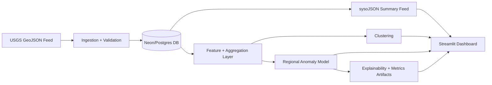

# Real-Time Earthquake Analytics

End-to-end earthquake analytics platform with ingestion, validation, clustering, anomaly detection, explainability, and a live dashboard.

## Live Deployment

- Streamlit app: [real-time-earthquake-analytics-57bvnvydgnv5gz8bgnurfu.streamlit.app](https://real-time-earthquake-analytics-57bvnvydgnv5gz8bgnurfu.streamlit.app/)
- Data pipeline scheduler: GitHub Actions (`.github/workflows/earthquake_pipeline.yml`)
- Database: Neon Postgres

## What This Project Does

- Ingests earthquake feed data (USGS GeoJSON or local file source).
- Applies strict validation and quality checks before storage.
- Stores curated events in a relational database (SQLAlchemy + Postgres/SQLite).
- Builds spatial-temporal clusters to capture aftershock/surge behavior.
- Runs a lightweight regional activity model with anomaly scoring.
- Generates explainability outputs and model metrics artifacts.
- Powers an interactive Streamlit dashboard with map, trends, alerts, and quality panels.

## Architecture



## Production Flow (Current)

1. GitHub Actions runs the pipeline every 5 minutes.
2. Pipeline ingests latest feed data and updates Neon DB.
3. Streamlit app reads from Neon DB and displays latest analytics.
4. New runs are visible in `ingestion_runs` table.

## Repository Structure

```text
.
|-- .github/workflows/earthquake_pipeline.yml
|-- dashboard/app.py
|-- data/all_month.geojson
|-- docs/
|   |-- hypothesis_matrix.md
|   `-- runbook.md
|-- artifacts/
|   |-- eda_hypothesis_plots.png
|   |-- model_validation_scatter.png
|   |-- model_validation_timeseries.png
|   |-- model_metrics_latest.json
|   |-- model_metrics_history.jsonl
|   |-- model_explainability_latest.json
|   `-- model_run.log
|-- output/
|   |-- syso_summary_feed.json
|   `-- syso_summary_feed.geojson
`-- src/earthquake_analytics/
```

## Local Run

```bash
pip install -e .
copy .env.example .env
python -m earthquake_analytics
python -m streamlit run dashboard/app.py
```

## Visualizations

### Hypothesis-Driven EDA


### Model Validation (Predicted vs Observed)


### Model Validation (Time Series)


## Key Outputs

| Category | File |
|---|---|
| Summary Feed (JSON) | `output/syso_summary_feed.json` |
| Summary Feed (GeoJSON) | `output/syso_summary_feed.geojson` |
| Latest Metrics | `artifacts/model_metrics_latest.json` |
| Metrics History | `artifacts/model_metrics_history.jsonl` |
| Explainability | `artifacts/model_explainability_latest.json` |
| Run Logs | `artifacts/model_run.log` |

## Modeling and Explainability

- Model predicts expected regional event activity from recent + seasonal behavior.
- Anomaly scoring uses z-scores on observed vs expected activity.
- Explainability includes contribution breakdowns and reason flags.
- Metrics tracked include `precision`, `accuracy`, `recall`, `f1`, `mae`, `rmse`.

## Deployment Notes

- Dashboard host: Streamlit Community Cloud.
- Scheduler host: GitHub Actions (cron every 5 minutes, with manual trigger support).
- Required GitHub secret:
  - `EARTHQUAKE_DB_URL=postgresql+psycopg2://<user>:<password>@<host>/<db>?sslmode=require`

## License

MIT
